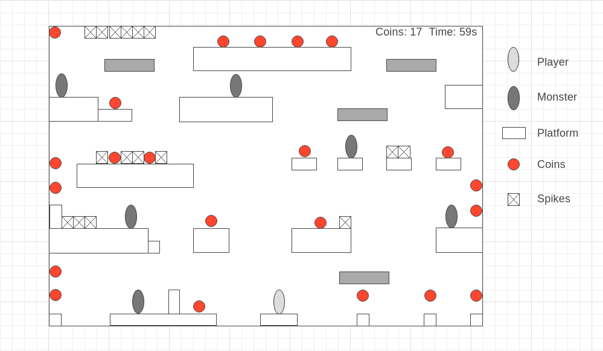

# Coin Explorer

## Background and Overview

Coin Explorer is a platform game where a user controls a character to collect as many coins as possible in a set time frame. The game will be over upon dying to obstacles (spikes, monsters, etc) or when the time runs out. The character will be able to shoot monsters to kill them. The goal is to collect as many coins as possible before the time runs out and achieve a top standing on the leaderboards. 

## Functionality and MVPs

In Coin Explorer, users will be able to:
* Move left, right, and jump
* Shoot monsters
* Collect coins
* See current time left and coins collected
* See top scores on leaderboards 

## Wireframes

https://wireframe.cc/VIcLO6

## Architecture and Technology

* Javascript
* CanvasHTML

## Implementation Timeline

* Day 1
  * Organize/update file structures, Research/write game logic
* Day 2
  * Javascript/CanvasHTML - TBD
* Day 3
  * Javascript/CanvasHTML - TBD
* Day 4
  * Javascript/CanvasHTML - TBD
* Day 5 
  * Javascript/CanvasHTML - TBD

## Bonus Features

* Be able to buy new characters/weapons with coins (maybe different abilities)
* Make the level randomly generated instead of a static level
