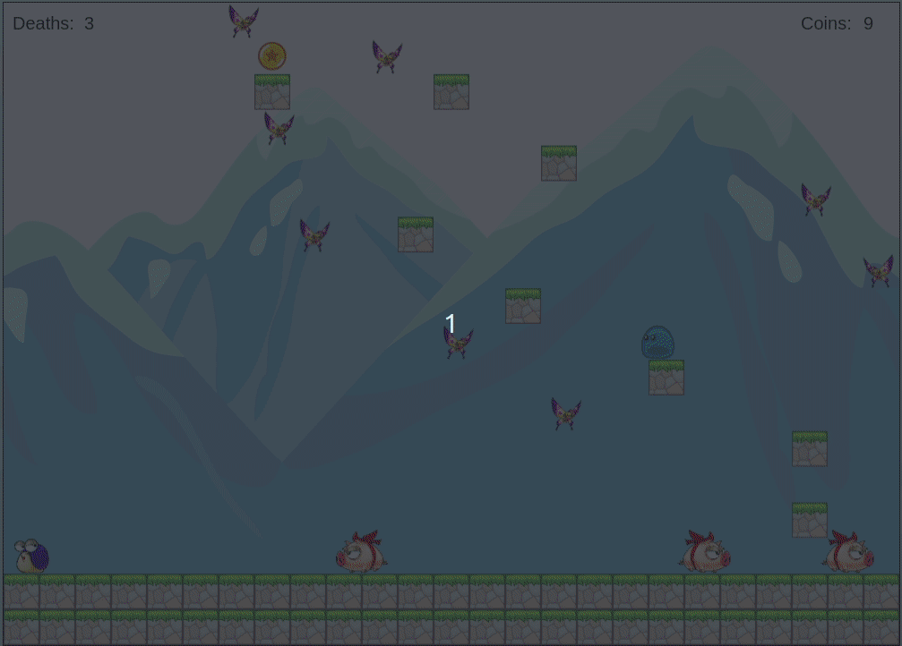

# Coin Explorer

## Background and Overview

Coin Explorer is a level based platform game where a user controls a slime to collect all the coins in order to move on to the next level. The game will be over upon dying to obstacles (spikes, monsters, etc) and the user is able to restart at their current level. The goal is to beat as many levels as possible with the least amount of deaths.

[##Live Link](https://chenq7.github.io/CoinExplorer/)

## Functionality and MVPs

In Coin Explorer, users will be able to:
* Move left, right, and jump
* Collide with platforms and obstacles
* Collect coins
* See death count and coins collected
* Die to monsters and obstacles such as spikes 

## Architecture and Technology

* Javascript - v.8.10
* CanvasHTML / HTML5

## Features

### Home screen


The game starts by rendering the home screen with an onclick listener set for the enter key to start the game.

### Sample gameplay with tile colision detection


One of the major challenges of this project was implementing platform collision detection. In the update character class, the player's position would be checked every animation frame and be compared to the board state to check whether or not the player is currently inside a tile. This value would then be passed on to the handle tile collision function.

```
  handleTileCollision(value, tileX, tileY, tileSize){
    if (value instanceof Object && value instanceof Tile){
      if (this.topTileCollision(tileY)) return;
      if (this.leftTileCollision(tileX)) return;
      if (this.rightTileCollision(tileX + tileSize)) return;
    }
  }

  topTileCollision(topTile) {
    if (this.getBottom() > topTile && this.getPrevBottom() <= topTile) {
      this.setPrevBottom(this.getBottom());
      this.setBottom(topTile - 0.01);
      this.jumping = false;
      return true;
    }
    return false;
  }

  leftTileCollision(leftTile){
    if (this.getRight() > leftTile && this.getPrevRight() <= leftTile){
      this.setPrevRight(this.getRight());
      this.setRight(leftTile - 0.01);
      return true; 
    }
    return false;
  }

  rightTileCollision(rightTile){
    if (this.getLeft() < rightTile && this.getPrevLeft() >= rightTile){
      this.setPrevLeft(this.getLeft());
      this.setLeft(rightTile);
      return true;
    }
    return false;
  }
```
If the player is currently in a tile, it would then call one of the top, left, or right helper functions to reset the position of the player to its previous position before hitting a tile. bottomTileCollision function is intentionally left out so that the player can pass through the tile from the bottom up. 

### Game over screen upon hitting spikes


This check is done using handleSpikeCollision function inside character class by passing in the array of spikes for that level and checking whether or not the player's current position is touching a spike. If the function returns true, it would increment death count by 1 and render the game over screen.

```
  handleSpikeCollision(spikes) {
    for (let i = 0; i < spikes.length; i++) {
      if (
        this.getLeft() < spikes[i].position.x + spikes[i].width &&
        this.getLeft() + spikes[i].width > spikes[i].position.x &&
        this.getTop() < spikes[i].position.y + spikes[i].height &&
        this.getBottom() > spikes[i].position.y) {
        return true;
      }
    }
    return false;
  }
```

### Victory screen upon clearing all levels


Every time the player clears a level, the instance variable, currentLevel will be incremented by 1. When currentLevel equals to maxLevel, it will call renderWin to render the victory screen

```
  renderWin() {
    this.gameMusic.pause();
    this.play(this.winMusic);
    this.ctx.clearRect(0, 0, this.gameWidth, this.gameHeight);

    this.ctx.fillStyle = "black";
    this.ctx.fillRect(0, 0, this.gameWidth, this.gameHeight);

    this.ctx.font = "bold 80px Arial";
    this.ctx.fillStyle = "white";
    this.ctx.fillText("YOU WIN!", 305, 200);

    this.ctx.font = "bold 30px Arial";
    this.ctx.fillText("Congrats on beating the game!", 280, 480);

    this.ctx.fillStyle = "blue"
    this.ctx.fillText(`You died a total of ${this.numDeaths} times`, 322, 560);
    
    this.ctx.fillStyle = "white"
    this.ctx.font = "bold 20px Arial";
    this.ctx.fillText("Press esc to go back to home screen", 325, 640);

    const chest = new Image();
    chest.onload = function () {
      this.ctx.drawImage(chest, 430, 250, 139, 149);
    }.bind(this);
    chest.src = "./src/images/items/chest-gold-close.png";
  }
```

## Bonus Features

* Be able to kill monsters with slime and add monster drop
* Make a new mode where levels are randomly generated
* fog animation in background, styling each level, etc
